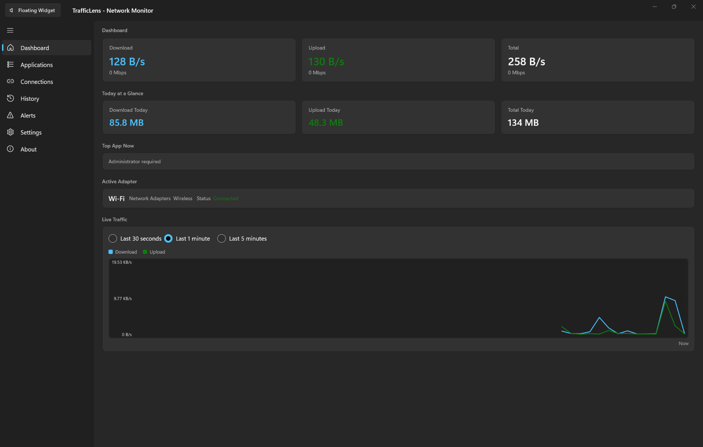
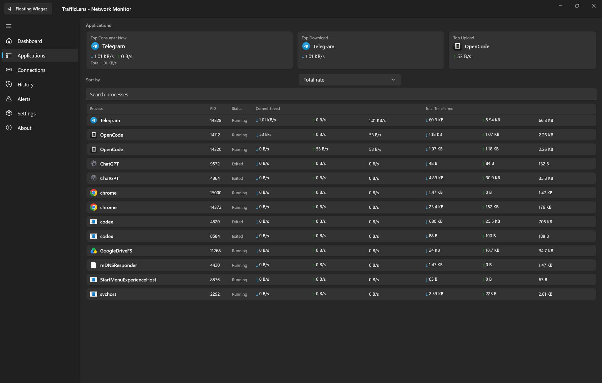
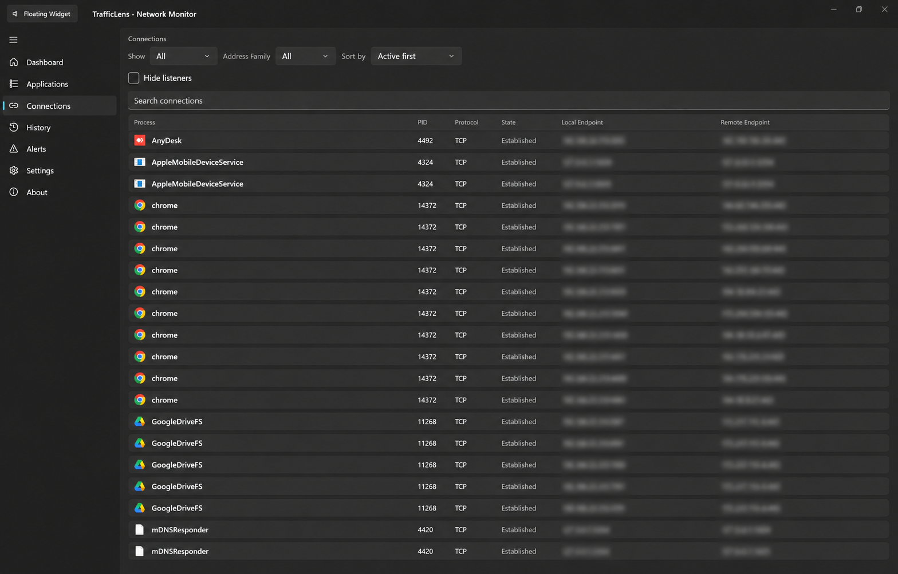
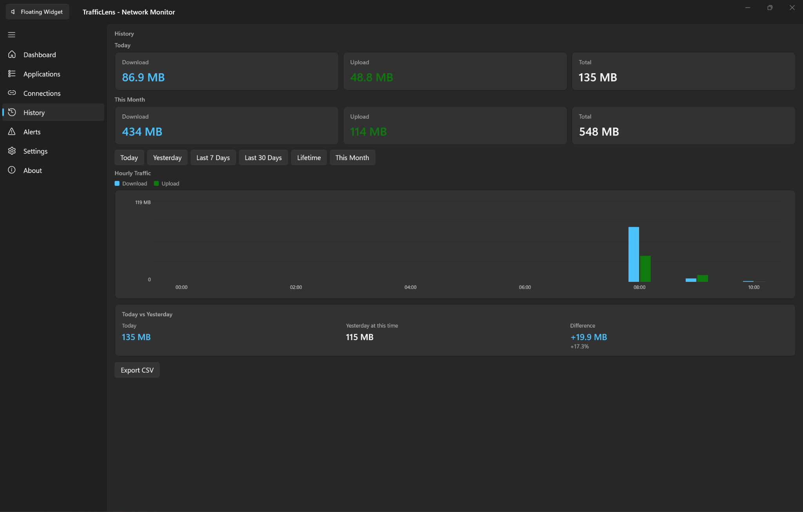
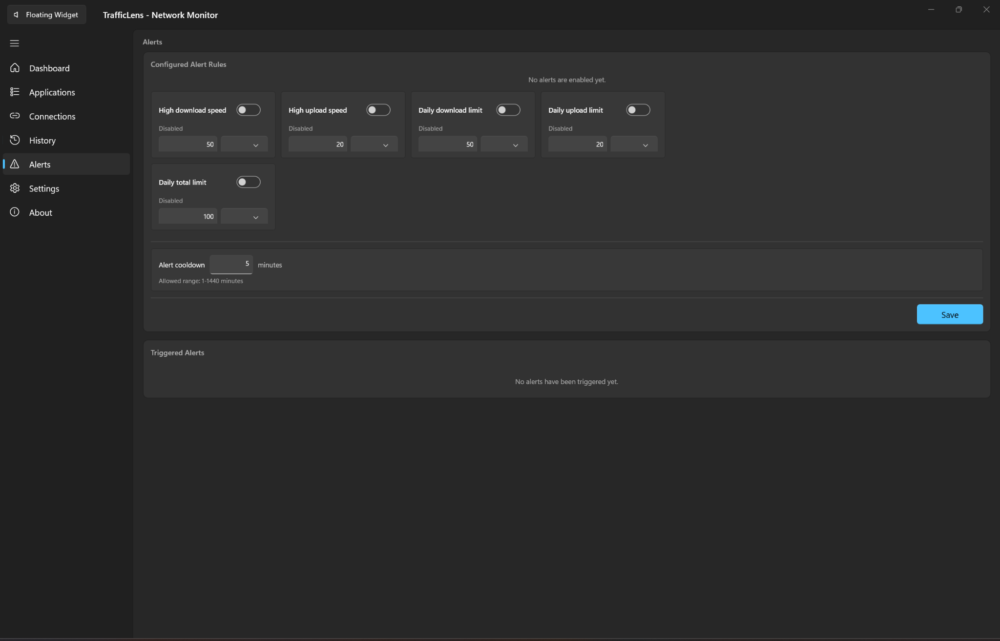
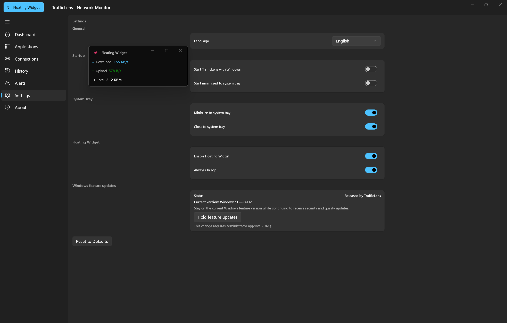

# TrafficLens

A lightweight, real-time network traffic monitor built for Windows.

TrafficLens shows what your Windows PC is doing on the network, right now. It reports
real-time bandwidth, breaks usage down per application, lists active connections, keeps
traffic history, and can raise alerts when traffic crosses thresholds you set. It also
offers a floating always-on-top widget and a system tray icon so it stays out of the way.

Monitoring is **local to your Windows PC**. Nothing is uploaded, and there is no account,
cloud service, or telemetry endpoint.

[](https://github.com/nabilety008/TrafficLens/releases/latest)
[](https://learn.microsoft.com/windows/)
[](https://dotnet.microsoft.com/)
[](https://learn.microsoft.com/windows/apps/winui/)
[](https://learn.microsoft.com/windows/win32/winprog64/)

---

## Download

**Latest stable release: `v0.1.6`**

| | |
|---|---|
| **Recommended** | [**TrafficLens-Setup-0.1.6-win-x64.exe**](https://github.com/nabilety008/TrafficLens/releases/download/v0.1.6/TrafficLens-Setup-0.1.6-win-x64.exe) |
| Portable (no install) | [TrafficLens-Portable-0.1.6-win-x64.zip](https://github.com/nabilety008/TrafficLens/releases/download/v0.1.6/TrafficLens-Portable-0.1.6-win-x64.zip) |
| All releases | [github.com/nabilety008/TrafficLens/releases](https://github.com/nabilety008/TrafficLens/releases) |
| Platform | Windows x64 |

For most people, take the **installer**. Pick the portable ZIP only if you would rather run
TrafficLens without installing it.

## Screenshots



## Features

**Monitoring**

- Real-time download and upload speed
- Current session traffic totals
- Per-application network usage, with current and cumulative process traffic
- Active TCP and UDP connections
- IPv4 and IPv6 connection visibility
- Physical, tunnel, and virtual adapter visibility where applicable

**History and charts**

- Traffic history persisted locally in SQLite
- Live traffic charts
- Historical charts
- CSV export of history data

**Alerts and integration**

- Configurable traffic alerts
- Floating network widget
- System tray integration
- Optional start with Windows

**Windows Update policy**

- Can hold the current Windows feature version, while security updates, quality updates,
  Defender updates, and all other Windows Update servicing continue normally
- Release the hold at any time, restoring the previous state
- Never disables Windows Update and never touches security or quality updates

**Interface**

- English and Persian (فارسی) user interface
- Full right-to-left (RTL) layout support

## Screenshots

<table>
  <tr>
    <td width="50%" align="center"></td>
    <td width="50%" align="center"></td>
  </tr>
  <tr>
    <td align="center"><em>Per-application traffic usage</em></td>
    <td align="center"><em>Active TCP/UDP connections</em></td>
  </tr>
  <tr>
    <td align="center"></td>
    <td align="center"></td>
  </tr>
  <tr>
    <td align="center"><em>Traffic history and charts</em></td>
    <td align="center"><em>Traffic alerts</em></td>
  </tr>
  <tr>
    <td align="center"></td>
    <td></td>
  </tr>
  <tr>
    <td align="center"><em>Settings and the floating widget</em></td>
    <td></td>
  </tr>
</table>

## Installation

1. Download [`TrafficLens-Setup-0.1.6-win-x64.exe`](https://github.com/nabilety008/TrafficLens/releases/download/v0.1.6/TrafficLens-Setup-0.1.6-win-x64.exe)
2. Run the installer. It installs per-user, so no administrator prompt is required.
3. Launch **TrafficLens**.

A portable ZIP is available from the [same release](https://github.com/nabilety008/TrafficLens/releases/tag/v0.1.6) if you prefer
not to install: extract it and run `TrafficLens.WinUI.exe`.

TrafficLens stores its own data under your user profile and never modifies your existing
network configuration.

## Verify your download

Both files are published as unsigned release candidates. You can confirm you received the
exact files published here by comparing their SHA-256 checksums.

**`TrafficLens-Setup-0.1.6-win-x64.exe`**

```
3332235ABB7B7ADA857EA3D0D41273F5E51D74A1B6DAE96B98ED83F4740CAB8E
```

**`TrafficLens-Portable-0.1.6-win-x64.zip`**

```
9F9375B505961CA85778F09187C3D5EB2674AAE6204B49A5E198628590555795
```

```powershell
Get-FileHash .\TrafficLens-Setup-0.1.6-win-x64.exe -Algorithm SHA256
```

## System requirements

| | |
|---|---|
| OS | Windows 10 or Windows 11 |
| Architecture | x64 |
| Runtime | Bundled — no separate .NET install required |
| Disk | ~230 MB for the extracted application |

## Administrator permissions

Most of TrafficLens runs normally without elevation. Detailed **per-application** network
monitoring can require Administrator privileges, because Windows exposes that data through
ETW and kernel network interfaces that are restricted by default.

When TrafficLens is not elevated, it logs a warning and reports a reduced per-process view
instead of failing. Everything else, including overall bandwidth, totals, history, and
alerts, continues to work.

## Local-first & privacy-conscious

- Monitoring is performed **locally** on your Windows PC.
- TrafficLens focuses on network **counters** and **connection metadata** — speed, byte
  totals, process names, addresses, ports, and protocols.
- **Packet payload contents are never captured.** TrafficLens does not inspect, store, or
  log the contents of network traffic.
- TrafficLens is a **monitor, not a traffic blocker or rate limiter.** It does not throttle,
  filter, redirect, or firewall your traffic.

TrafficLens is an ordinary local application and is subject to the same trust considerations
as any software you run. Review the source if you want to verify these claims yourself.

## Unsigned release notice

`v0.1.6` is currently **unsigned**.

Windows may therefore display an **Unknown publisher** warning or a Microsoft Defender
SmartScreen reputation warning, because the binary is not signed by a recognized publisher.
This is expected for an unsigned release and does not indicate a problem with the file.

Check the SHA-256 checksum above if you want to confirm the file's integrity. Please do not
disable Windows Security, Defender, or SmartScreen.

## Build from source

TrafficLens is a Windows-only .NET 8 solution. Building it requires:

| | |
|---|---|
| OS | Windows 10/11 (the WinUI 3 project does not build on other platforms) |
| SDK | .NET 8 SDK |
| Installer build | [Inno Setup 6](https://jrsoftware.org/isinfo.php) — only needed to build the installer |

```powershell
git clone https://github.com/nabilety008/TrafficLens.git
cd TrafficLens

# Restore, build, and test
dotnet restore TrafficLens.sln
dotnet build TrafficLens.sln -c Release -p:Platform=x64
dotnet test TrafficLens.sln -c Release -p:Platform=x64 --no-build

# Run
dotnet run --project src/TrafficLens.WinUI -c Release -p:Platform=x64
```

> **Note:** `-p:Platform=x64` is required. The WinUI 3 project declares `<Platforms>x64</Platforms>`,
> `WindowsAppSDKSelfContained=true`, and `RuntimeIdentifiers=win-x64`. Without it, the WinUI
> project will not build.

To produce the installer, portable ZIP, and checksum sidecars, run the release script with
Inno Setup 6 installed:

```powershell
.\scripts\build-release.ps1 -Version 0.1.6
```

Further build, test, and packaging notes are in [`handoff/BUILD_AND_TEST.md`](handoff/BUILD_AND_TEST.md).

## Tech stack

| | |
|---|---|
| Language | C# |
| Runtime | .NET 8 |
| UI | WinUI 3 / Windows App SDK |
| Architecture | MVVM |
| Storage | SQLite |
| Data sources | Windows ETW and Windows networking APIs |

The solution is layered as `Core` (domain), `Network` (collectors), `Infrastructure`
(storage, settings, logging), and `WinUI` (application shell). Architecture detail lives in
[`docs/ARCHITECTURE.md`](docs/ARCHITECTURE.md).

## Project status

Latest stable release: **`v0.1.6`**

Release history and downloads: [github.com/nabilety008/TrafficLens/releases](https://github.com/nabilety008/TrafficLens/releases)

## Contributing

Issues and pull requests are welcome.

- [Open an issue](https://github.com/nabilety008/TrafficLens/issues) to report a bug or
  request an improvement
- [Open a pull request](https://github.com/nabilety008/TrafficLens/pulls) if you would like to
  contribute a fix or an enhancement

Please open an issue before starting a larger change, so effort is not duplicated and the
approach can be discussed first.